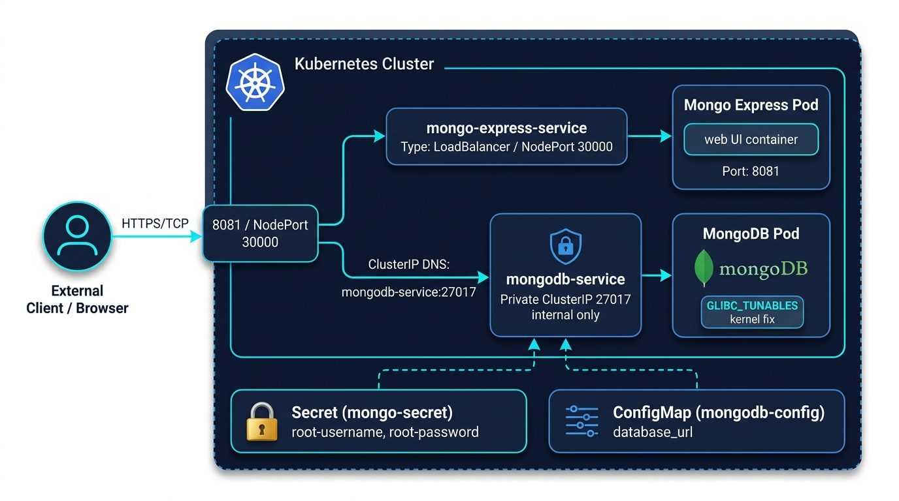

# 🚀 MongoDB & Mongo Express on Kubernetes

A complete, beginner-friendly, and production-minded guide to deploying a containerized **MongoDB** database and a **Mongo Express** web-based administrative dashboard on **Kubernetes**.

Written from the perspective of a Senior DevOps Engineer, this guide breaks down every manifest, design decision, networking rule, and deployment phase so you can understand not just *what* commands to run, but *why* Kubernetes works this way.

---

## 📑 Table of Contents
1. [Architecture Overview](#-architecture-overview)
2. [Repository Structure](#-repository-structure)
3. [Core Kubernetes Concepts (The "Why")](#-core-kubernetes-concepts-the-why)
4. [Prerequisites](#-prerequisites)
5. [Step-by-Step Deployment Guide](#-step-by-step-deployment-guide)
6. [Accessing Mongo Express](#-accessing-mongo-express)
7. [Operational Deep Dive & Troubleshooting](#-operational-deep-dive--troubleshooting)
8. [Senior DevOps Best Practices & Roadmap](#-senior-devops-best-practices--roadmap)

---

## 🏛 Architecture Overview

In a typical cloud-native architecture, your database must **never** be exposed directly to the public internet. Instead, it sits securely inside an internal private network, while the management UI is exposed through a managed service.



```
                           +------------------------------------------------+
                           |               Kubernetes Cluster               |
                           |                                                |
  [ Web Browser ]          |   +----------------------------------------+   |
         |                 |   | mongo-express-service                  |   |
         | (Port 8081 /    |   | Type: LoadBalancer / NodePort: 30000   |   |
         |  NodePort 30000)|   +-------------------+--------------------+   |
         v                 |                       |                        |
+-----------------+        |                       v                        |
| External Client |------->|        [ mongo-express Pod ]                   |
+-----------------+        |          |  (Web Interface)                    |
                           |          |                                     |
                           |          | Connects via internal DNS:          |
                           |          | "mongodb-service:27017"             |
                           |          v                                     |
                           |   +----------------------------------------+   |
                           |   | mongodb-service (ClusterIP: Internal)  |   |
                           |   +-------------------+--------------------+   |
                           |                       |                        |
                           |                       v                        |
                           |            [ mongodb-deployment Pod ]          |
                           |              (Database Engine)                 |
                           |                                                |
                           |   +-------------------+   +----------------+   |
                           |   | ConfigMap         |   | Secret         |   |
                           |   | (database_url)    |   | (root-user/pwd)|   |
                           |   +-------------------+   +----------------+   |
                           +------------------------------------------------+
```

### Traffic Flow:
1. The **User** sends an HTTP request to `mongo-express-service` on port `8081` (or NodePort `30000`).
2. `mongo-express-service` forwards the request to the `mongo-express` container.
3. The `mongo-express` pod queries `mongodb-service:27017` using cluster-internal DNS.
4. `mongodb-service` routes traffic directly to the `mongodb` pod.
5. Sensitive credentials (usernames and passwords) are securely mounted into both pods via Kubernetes **Secrets**, while service endpoints are injected via a **ConfigMap**.

---

## 📂 Repository Structure

| File | Kubernetes Kind | Purpose |
| :--- | :--- | :--- |
| `mongodb-secret.yaml` | `Secret` | Stores base64-encoded database root credentials (`username`, `password`). |
| `MongoDB-config.yaml` | `ConfigMap` | Stores non-sensitive configuration data (e.g., internal service host `database_url`). |
| `MongoDB.yaml` | `Deployment` | Runs the MongoDB database container, sets resource environment variables, and applies kernel workarounds. |
| `MongoDB-service.yaml` | `Service` (`ClusterIP`) | Internal-only virtual IP and DNS name for MongoDB (`mongodb-service:27017`). |
| `mongo-express.yaml` | `Deployment` | Runs the Mongo Express web UI, dynamically pulling DB credentials from the Secret and ConfigMap. |
| `mongo-express-service.yaml` | `Service` (`LoadBalancer`) | Exposes the web UI to external traffic with fixed `nodePort: 30000`. |

---

## 💡 Core Kubernetes Concepts (The "Why")

### 1. Secrets vs. ConfigMaps
- **`ConfigMap` (`MongoDB-config.yaml`)**: Designed for non-confidential configuration values. We store `database_url: mongodb-service` here. If the service name changes, we only update this ConfigMap—no application code or deployment restructuring needed.
- **`Secret` (`mongodb-secret.yaml`)**: Designed for confidential data like passwords. Kubernetes stores values base64-encoded. Both the MongoDB pod and Mongo Express pod consume the *exact same* secret, guaranteeing that credentials never go out of sync.

### 2. Service Types: `ClusterIP` vs. `LoadBalancer` / `NodePort`
- **MongoDB uses `ClusterIP`**: `ClusterIP` assigns a stable, internal-only virtual IP accessible **only within the cluster**. Databases should *never* have public IPs or external access unless strictly routed through a secure VPN or bastion.
- **Mongo Express uses `LoadBalancer` with `nodePort: 30000`**: This exposes port `8081` externally. In local environments like Minikube, you can reach the app via NodePort `30000`. In cloud providers (AWS EKS, GCP GKE), it provisions a cloud load balancer (e.g., AWS NLB/CLB).

### 3. Why `replicas: 1` for MongoDB?
In standard deployments, you scale stateless applications by setting `replicas: 3` or `5`. 
However, **MongoDB is a stateful database**. Running `replicas: 2` on a plain Deployment means you have two independent database instances running side by side without synchronization. When Mongo Express connects, requests would bounce between the two, resulting in ghost/missing data!
> **DevOps Rule:** For standalone demo databases, always keep `replicas: 1`. For high availability in production, use a MongoDB Replica Set deployed with a **StatefulSet** or an **Operator** (e.g., MongoDB Community Operator).

### 4. Linux Kernel 6.19+ Workaround (`GLIBC_TUNABLES`)
Modern host kernels (Linux 6.19+ used in modern Docker Desktop, Minikube, and EKS nodes) have a known incompatibility with TCMalloc inside MongoDB 8+ (`SERVER-121912`), which causes MongoDB to crash on startup with:
```text
MongoDB cannot start: Linux kernel versions 6.19 and newer has a known incompatibility with this version of MongoDB.
```
In `MongoDB.yaml`, we inject:
```yaml
- name: GLIBC_TUNABLES
  value: "glibc.pthread.rseq=1"
```
This forces glibc to handle restartable sequences (`rseq`) properly and enables MongoDB to boot cleanly without crashes.

---

## 🛠 Prerequisites

Before deploying, ensure you have the following installed on your machine:
- [Docker](https://docs.docker.com/get-docker/)
- [kubectl](https://kubernetes.io/docs/tasks/tools/) (Kubernetes CLI)
- A running Kubernetes cluster:
  - [Minikube](https://minikube.sigs.k8s.io/docs/start/) (Recommended for local development)
  - OR [Docker Desktop Kubernetes](https://docs.docker.com/desktop/kubernetes/)
  - OR [Kind](https://kind.sigs.k8s.io/)
  - OR a managed cloud cluster ([AWS EKS](https://aws.amazon.com/eks/), [GCP GKE](https://cloud.google.com/kubernetes-engine), etc.)

Verify your cluster connection:
```bash
kubectl cluster-info
```

---

## 🚀 Step-by-Step Deployment Guide

> **Senior DevOps Rule:** Deployment order matters! Always deploy configuration dependencies (`Secret`, `ConfigMap`) **before** deploying workloads that depend on them.

### Step 1: Create Secrets and Configuration
```bash
# 1. Apply Secret (Database Root Credentials)
kubectl apply -f mongodb-secret.yaml

# 2. Apply ConfigMap (Database Endpoint Config)
kubectl apply -f MongoDB-config.yaml
```

*Verification:*
```bash
kubectl get secret mongo-secret
kubectl get configmap mongodb-config
```

---

### Step 2: Deploy the MongoDB Database
```bash
# 1. Deploy MongoDB Pod
kubectl apply -f MongoDB.yaml

# 2. Deploy MongoDB Internal ClusterIP Service
kubectl apply -f MongoDB-service.yaml
```

*Verification:*
```bash
kubectl get pods -l app=mongodb
kubectl get svc mongodb-service
```
Wait until the MongoDB pod status shows `Running` (1/1).

---

### Step 3: Deploy the Mongo Express Web UI
```bash
# 1. Deploy Mongo Express Pod
kubectl apply -f mongo-express.yaml

# 2. Deploy Mongo Express External Service
kubectl apply -f mongo-express-service.yaml
```

*Verification:*
```bash
kubectl get pods -l app=mongo-app
kubectl get svc mongo-express-service
```

---

### Step 4: Verify the Entire Stack
Run this one command to check the health of all resources:
```bash
kubectl get all
```

Expected output should look similar to:
```text
NAME                                      READY   STATUS    RESTARTS   AGE
pod/mongo-express-6bf89c4d9f-xyz12        1/1     Running   0          45s
pod/mongodb-deployment-7f8d6cb58-abc34    1/1     Running   0          90s

NAME                            TYPE           CLUSTER-IP       EXTERNAL-IP   PORT(S)          AGE
service/kubernetes              ClusterIP      10.96.0.1        <none>        443/TCP          10h
service/mongo-express-service   LoadBalancer   10.101.37.185    <pending>     8081:30000/TCP   40s
service/mongodb-service         ClusterIP      10.100.11.134    <none>        27017/TCP        90s

NAME                                 READY   UP-TO-DATE   AVAILABLE   AGE
deployment.apps/mongo-express        1/1     1            1           45s
deployment.apps/mongodb-deployment   1/1     1            1           90s
```

---

## 🌐 Accessing Mongo Express

Depending on where your Kubernetes cluster is running, use one of the following methods:

### Option A: Using Minikube (Local Development)
Minikube has a built-in helper that opens the NodePort service in your default browser:
```bash
minikube service mongo-express-service
```
Or retrieve the Minikube IP and navigate to port `30000`:
```bash
echo "http://$(minikube ip):30000"
```

### Option B: Port Forwarding (Works Anywhere)
If you are behind a firewall or using Kind / Docker Desktop:
```bash
kubectl port-forward svc/mongo-express-service 8081:8081
```
Then open your browser at: **[http://localhost:8081](http://localhost:8081)**.

### Option C: Cloud Providers (AWS EKS / GCP GKE)
Check the `EXTERNAL-IP` column of the service:
```bash
kubectl get svc mongo-express-service
```
Once the cloud provider provisions the load balancer, visit:
```text
http://<EXTERNAL-IP>:8081
```

---

## 🔍 Operational Deep Dive & Troubleshooting

As a DevOps engineer, knowing how to debug issues quickly is essential. Here is your cheat sheet:

### 1. Pod is stuck in `CrashLoopBackOff`
Check the logs of the crashing container:
```bash
# For MongoDB:
kubectl logs -l app=mongodb --tail=50

# For Mongo Express:
kubectl logs -l app=mongo-app --tail=50
```
*Common Cause:* If MongoDB crashes with `Linux kernel versions 6.19 and newer`, ensure `GLIBC_TUNABLES: "glibc.pthread.rseq=1"` is present in `MongoDB.yaml`.

### 2. Pod is in `CreateContainerConfigError`
Inspect the pod events to see which secret or configmap key is missing:
```bash
kubectl describe pod -l app=mongo-app
```
*Common Cause:* Typo in `secretKeyRef` or `configMapKeyRef` name or key. Verify keys in `mongodb-secret.yaml` and `MongoDB-config.yaml`.

### 3. Mongo Express cannot connect to MongoDB
Execute an interactive shell inside the Mongo Express pod to test internal DNS resolution and network connectivity:
```bash
kubectl exec -it deployment/mongo-express -- nc -zv mongodb-service 27017
```
If it cannot resolve `mongodb-service`, verify that `MongoDB-service.yaml` has been applied and that the selector `app: mongodb` matches the pod label in `MongoDB.yaml`.

---

## 🧭 Senior DevOps Best Practices & Roadmap

This project is a solid, functional cloud-native baseline. When preparing for **enterprise production**, consider implementing the following best practices:

1. **StatefulSet & Persistent Volumes (PVC):**
   Deployments are ephemeral. If the MongoDB pod is deleted, all stored documents are lost. Use a `PersistentVolumeClaim` (backed by AWS EBS, GCP Persistent Disk, or NFS) and a `StatefulSet` to ensure database records persist across pod restarts.

2. **GitOps & Secret Management:**
   Never commit raw or base64 credentials to a public git repository. In enterprise setups:
   - Use **HashiCorp Vault**, **AWS Secrets Manager**, or **GCP Secret Manager**.
   - Use **External Secrets Operator (ESO)** or **Sealed Secrets** to inject credentials securely at runtime.

3. **Resource Requests & Limits:**
   Prevent containers from consuming all node memory or CPU by declaring explicit boundaries in container specs:
   ```yaml
   resources:
     requests:
       memory: "256Mi"
       cpu: "250m"
     limits:
       memory: "512Mi"
       cpu: "500m"
   ```

4. **Liveness & Readiness Probes:**
   Help Kubernetes know when containers are healthy or ready to accept user traffic:
   ```yaml
   readinessProbe:
     tcpSocket:
       port: 27017
     initialDelaySeconds: 5
     periodSeconds: 10
   ```

5. **Network Policies:**
   Implement Kubernetes `NetworkPolicy` to restrict traffic so that *only* the Mongo Express pod can talk to `mongodb-service`, blocking all other cluster pods from reaching the database.

---

## 📄 License
This project is open-source and available under the [MIT License](LICENSE).